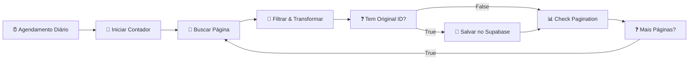

# Scraping Guide — BANCO DE PROMPTS

Documentação da automação de extração de prompts do [bananaprompts.xyz](https://www.bananaprompts.xyz/explore).

## Visão Geral

| Aspecto | Detalhe |
|---------|---------|
| **Workflow n8n** | `BANCO DE PROMPTS - Deep Scraper` (ID: `tKRng0JHYv4y5lTa`) |
| **Instância** | `https://n8n.destraveacademy.com` |
| **Agendamento** | Diário às 03:00 AM (America/Sao_Paulo) |
| **Tabela destino** | `public.prompts_vault` (Supabase) |
| **Credencial** | `bancodeprompts` (Supabase API — ID: `ta1XyquWeL2aUlgz`) |
| **Arquivo local** | `automations/n8n/deep_scraper_bancodeprompts.json` |

## Estratégia de Crescimento Controlado

| Fase | maxPages | Prompts estimados | Quando avançar |
|------|----------|-------------------|----------------|
| **Teste** | `1` | ~100 | Verificar se o upsert funciona |
| **Expansão** | `5` | ~500 | Após confirmar dados no Supabase |
| **Crescimento** | `10` | ~1.000 | Após validar performance |
| **Completo** | `999` | ~6.000+ | Sistema estável |

Altere `const maxPages = 1;` nos nós **Iniciar Contador** e **Check Pagination**.

## Fluxo do Workflow (8 nós)

## Configuração do Supabase (Salvar no Supabase)

| Config | Valor | Motivo |
|--------|-------|--------|
| **Operação** | `create` | Supabase trata upsert via PostgREST + UNIQUE constraint |
| **Tabela** | `prompts_vault` | — |
| **Data to Send** | `Auto-Map Input Data` | Mapeia campos do JSON direto para colunas |
| **Inputs to Ignore** | `_meta` | Exclui metadados de paginação do INSERT |
| **Credencial** | `bancodeprompts` (ID: `ta1XyquWeL2aUlgz`) | Supabase API |

### Como funciona o Upsert

O nó Supabase v1 **não tem operação "upsert" nativa**. O upsert é garantido pela constraint UNIQUE no banco:

1. `original_id` tem constraint `prompts_vault_original_id_key`
2. Se o `original_id` já existe → o Supabase retorna erro 409 (conflict)
3. O n8n continua para o próximo item (não para o workflow)

### Mapeamento Automático (autoMapInputData)

Os campos do JSON de entrada são mapeados **automaticamente** para as colunas do Supabase:

| Campo no JSON | Coluna no Supabase |
|---|---|
| `original_id` | `original_id` |
| `title` | `title` |
| `full_prompt` | `full_prompt` |
| `image_url` | `image_url` |
| `author_name` | `author_name` |
| `tags` | `tags` |
| `source_url` | `source_url` |
| `_meta` | ❌ **Excluído** via `inputsToIgnore` |

## Nós e Versões

| Nó | Tipo | Versão |
|---|---|---|
| **Agendamento Diário** | scheduleTrigger | 1.3 |
| **Iniciar Contador** | code | 2 |
| **Buscar Página de Prompts** | httpRequest | 4.2 |
| **Filtrar & Transformar** | code | 2 |
| **Tem Original ID?** | if | 2.3 |
| **Salvar no Supabase** | supabase | 1 |
| **Check Pagination** | code | 2 |
| **Mais Páginas?** | if | 2.3 |

## Pré-requisitos

1. Credencial `bancodeprompts` configurada na instância
2. Tabela `prompts_vault` criada (`supabase/migrations/001_initial_schema.sql`)
3. Ativar workflow no n8n
